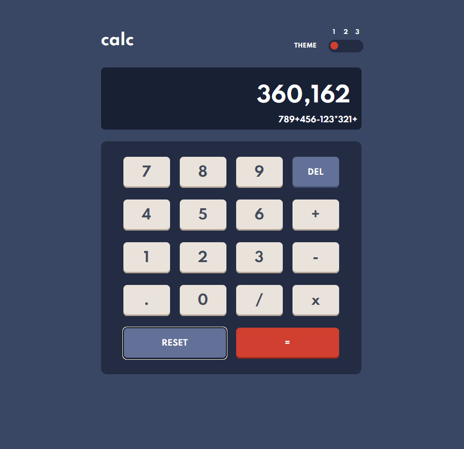

# Frontend Mentor - Calculator app solution

This is a solution to the [Calculator app challenge on Frontend Mentor](https://www.frontendmentor.io/challenges/calculator-app-9lteq5N29). Frontend Mentor challenges help you improve your coding skills by building realistic projects. 

## Table of contents

- [Overview](#overview)
  - [The challenge](#the-challenge)
  - [Screenshot](#screenshot)
  - [Links](#links)
- [My process](#my-process)
  - [Built with](#built-with)
  - [What I learned](#what-i-learned)
  - [Continued development](#continued-development)
  - [Useful resources](#useful-resources)
- [Author](#author)

**Note: Delete this note and update the table of contents based on what sections you keep.**

## Overview

### The challenge

Users should be able to:

- [x] See the size of the elements adjust based on their device's screen size
- [x] Perform mathmatical operations like addition, subtraction, multiplication, and division
- [x] Adjust the color theme based on their preference
- [x] **Bonus**: Have their initial theme preference checked using `prefers-color-scheme` and have any additional changes saved in the browser
- [x] **Extra**: Track the sum as it builds *(e.g. 789 + 456 - 123 * 321 as shown in the screenshot)*
- [x]  **Extra**: Keys coded up for keyboard users, both standard and numpad
	- [x] 'R' = Reset button shortcut
	- [x]  'T' = Toggle Themes
	- [x]  'M' = Multiply (because the standard * is assigned to 8)
	- [x]  Other keys are as on the keypad of the calculator

### Screenshot

### Links

- Solution URL: [Github Page](https://github.com/Tom-S82/fm_calculator_app_main)
- Live Site URL: [Add live site URL here](https://your-live-site-url.com)

## My process

### Built with

- HTML5
- CSS & custom properties
- Flexbox
- CSS Grid
- Mobile-first workflow
- Javascript

### What I learned

- Making the styling dynamic via Javascript made the styles inline.  It proved a lot easier and better to split the :root CSS variables into separate sheets and use Javascript to refer to the appropriate style sheet using the event listener.
- Converting numbers `toLocaleString()` was a useful way of getting the thousand separator working.  It forced a rounding to 3 decimal places though.

### Useful resources

- [Dynamic CSS theme changes](https://www.youtube.com/watch?v=r_hYR53r61M&t=5772s) - This video was a great example of how to dynamically change themes.

## Author

- Frontend Mentor - [@Tom-S82](https://www.frontendmentor.io/profile/Tom-S82)
